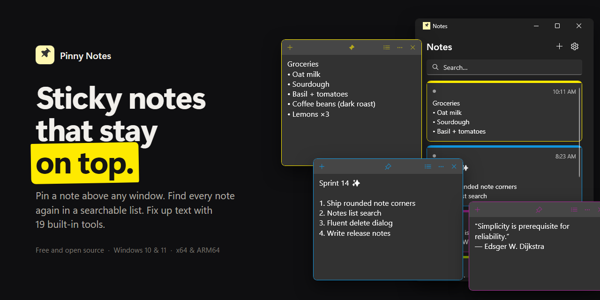
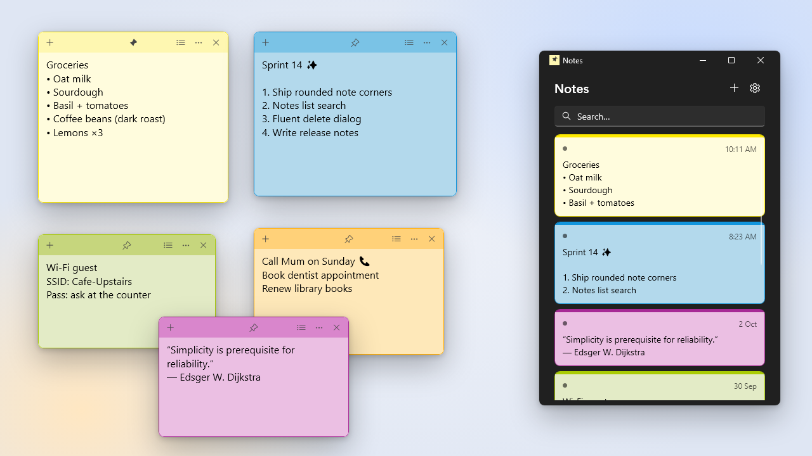

# Pinny Notes

[](https://github.com/N4m-N4m/PinnyNotes-/releases/latest)
[](https://github.com/N4m-N4m/PinnyNotes-/releases)
[](https://www.gnu.org/licenses/old-licenses/gpl-2.0.en.html)
[](https://github.com/N4m-N4m/PinnyNotes-/releases/latest)
[](https://dotnet.microsoft.com/)



**Pinny Notes** is a sticky note app for Windows that lets you **pin** notes so they stay on top of every other window. This fork gives it a modern, Fluent look inspired by Windows 11 Sticky Notes, with rounded notes, a searchable notes list and a cleaner title bar. It keeps all of the original's power-user text tools.

<p align="center">
  <a href="https://github.com/N4m-N4m/PinnyNotes-/releases/latest"><b>⬇️ Download the latest release</b></a>
</p>


## ✨ What's new in this fork

<picture>
  <source media="(prefers-color-scheme: dark)" srcset="assets/screenshot-dark.png">
  
</picture>

- **Modern note design:** rounded corners, Fluent icon buttons and a slimmer title bar with quick access to the notes list and note menu.
- **Notes list:** a Sticky Notes style overview of every note, with search, last-modified times, colour-coded cards and an indicator for notes that are open.
- **Safer deleting:** delete from the note menu with a Fluent confirmation dialog, including "Don't ask me again".
- **Created and modified times** are tracked for every note.
- **Behaves like Sticky Notes:** the app exits when the last window closes.
- **Ready-to-run downloads:** a single `.exe`, a portable `.zip` and an `.msi` installer for both **x64** and **ARM64**, with no .NET install required.

See the [CHANGELOG](CHANGELOG.md) for the full list.


## 💾 Download & Install (Windows 10 / 11)

Grab whichever suits you from the [**Releases page**](https://github.com/N4m-N4m/PinnyNotes-/releases/latest):

| File | Best for |
| --- | --- |
| `PinnyNotes-Setup-<version>-x64.msi` | **Most people.** Installs to Program Files and adds a Start menu shortcut. |
| `PinnyNotes-<version>-x64.exe` | **Just run it.** One file, nothing to install. Notes are saved to `%AppData%\Pinny Notes`. |
| `PinnyNotes-Portable-<version>-x64.zip` | **USB sticks and no-trace use.** Extract and run `Pinny Notes.exe`. Notes are saved next to the exe. |

On a Windows on ARM device (e.g. Snapdragon laptops), use the `arm64` version of the same file. Every download includes the .NET runtime, so there is nothing else to install. `SHA256SUMS.txt` lists checksums for every file.

> **"Windows protected your PC"?** Releases are being moved to free code signing through SignPath Foundation (see [Code signing policy](#-code-signing-policy)). Until a release is signed, SmartScreen may warn the first time you run it. Click **More info → Run anyway**.

> **⚠️ Linux support:** not planned. Pinny Notes is built with **WPF**, which is Windows-only. Modern Linux desktops on **Wayland** also don't let apps reliably set window positions or stay "always on top", both of which Pinny Notes depends on.


## 🚀 Features

- **Pin / Always on Top:** keep notes visible above all other windows.
- **Notes List:** browse, search and reopen every note, sorted by last modified.
- **Auto Save:** notes are saved automatically.
- **Block Minimizing:** keep notes on screen, even with the Show Desktop button.
- **Colours:** eight colours, optionally cycled automatically for new notes.
- **Light & Dark Mode:** a dark theme with colour-matched accents, or follow Windows.
- **Transparency:** make notes semi-transparent so content behind them can still be seen.
- **Start Position:** set where on the screen new notes open.
- **Startup & New Instance Behaviour:** restore open notes, create a new note or show the notes list.
- **Advanced Copy/Paste Actions**
  - **Copy/Paste Trim:** automatically trim whitespace when copying or pasting.
  - **Middle Click Paste:** quickly paste clipboard contents with a middle-click.
  - **Copy on Click:** hold Ctrl and click to copy selected text.
  - **Auto Copy:** automatically copy text when highlighted.
  - **No Selection Copy Behaviour:** copy the current line, the full note, or nothing when no text is selected.
- **Advanced Selection:**
  - **Triple-click:** select the current line.
  - **Quadruple-click:** select the full line, ignoring wrapping.
- **Indent Text:** indent selected text with the Tab key.
- **Auto Indent:** new lines match the previous line's indentation.
- **Ends with New Line:** notes always end with a newline.
- **Auto Scroll:** keeps the last line visible, handy when pasting.
- **Spell Checking:** uses the built-in Windows spell checker.
- **Counts Menu:** line, word and character counts for the selection or the full text.
- **Tray Icon:** bring all notes to the front or create a new note from the system tray.
- **Note Visibility:** show or hide notes in the Taskbar and Task Switcher (Alt+Tab and Win+Tab).
- **Lock Text:** make a note read-only until it's unlocked.
- **Export:** save any note as a `.txt` file.


## 🛠️ Tools

Right-click inside a note to transform the selected text (or the whole note):

- **Base64:** encode/decode Base64 text.
- **Bracket:** add/remove parentheses, square or curly brackets.
- **Case:** convert to lower, upper or proper case.
- **Colour:** convert between RGB and HEX values.
- **DateTime:** insert the current date/time, convert a date to a sortable format, or get the week number of the year.
- **Gibberish:** generate gibberish words, sentences, paragraphs, articles and names.
- **GUID:** generate GUIDs/UUIDs.
- **Hash:** generate MD5, SHA1 and SHA256/384/512 hashes.
- **HTML Entities:** encode/decode HTML entities.
- **Indent:** indent all lines using 2/4 spaces or tabs.
- **Join:** join multiple lines using commas, spaces or tabs.
- **JSON:** prettify JSON data.
- **List:** add numbering or bullets, sort lines, or remove list markers.
- **Quote:** add or remove single, double or backtick quotes.
- **Remove:** strip whitespace, slashes or repeated text.
- **Slash:** toggle or remove forward/back slashes.
- **Split:** split text by commas, tabs, spaces or a selected pattern.
- **Trim:** remove leading/trailing whitespace or blank lines.
- **URL:** encode and decode text for use in URLs.


## 🧑‍💻 Building from Source

You'll need the [.NET 10 SDK](https://dotnet.microsoft.com/download/dotnet/10.0) on Windows.

```powershell
# Run it
dotnet run --project PinnyNotes.WpfUi

# Build every release artifact (exe, portable zip, msi for x64 + ARM64) into .\dist
.\build\publish.ps1

# Or just one architecture, without the installer
.\build\publish.ps1 -Runtimes win-x64 -SkipInstaller
```

The installer is built with [WiX Toolset](https://wixtoolset.org/) 5, which is restored from NuGet automatically, so nothing extra needs installing.

**Releasing:** bump `<Version>` in `PinnyNotes.WpfUi/PinnyNotes.WpfUi.csproj`, add a matching `## vX.Y.Z` section to the [CHANGELOG](CHANGELOG.md), then push a tag:

```powershell
git tag v1.18.0
git push origin v1.18.0
```

The [Release workflow](.github/workflows/release.yml) builds everything and publishes a GitHub release, using that CHANGELOG section as the release notes. Tags with a hyphen (e.g. `v1.18.0-beta.1`) are marked as pre-releases.


## 🔏 Code signing policy

Free code signing provided by [SignPath.io](https://about.signpath.io), certificate by [SignPath Foundation](https://signpath.org).

- **Committers and reviewers:** [N4m-N4m](https://github.com/N4m-N4m)
- **Approvers:** [N4m-N4m](https://github.com/N4m-N4m)

Only files built from this repository by the [Release workflow](.github/workflows/release.yml) on GitHub-hosted runners are signed. Every signing request is approved by hand.

**Privacy:** Pinny Notes stores your notes and settings locally and does not send any information to other networked systems. The one exception is the optional update check (off by default, under Settings). When turned on, it asks the GitHub API once a week for the version number of the latest release.


## 🙏 Credits

Pinny Notes was created by [**63BeetleSmurf**](https://github.com/63BeetleSmurf/PinnyNotes). This fork builds on their work, so please consider supporting the original project:

[](https://liberapay.com/63BeetleSmurf/donate)
[](https://ko-fi.com/63BeetleSmurf)

Licensed under the [GNU General Public License v2](LICENSE.txt).
